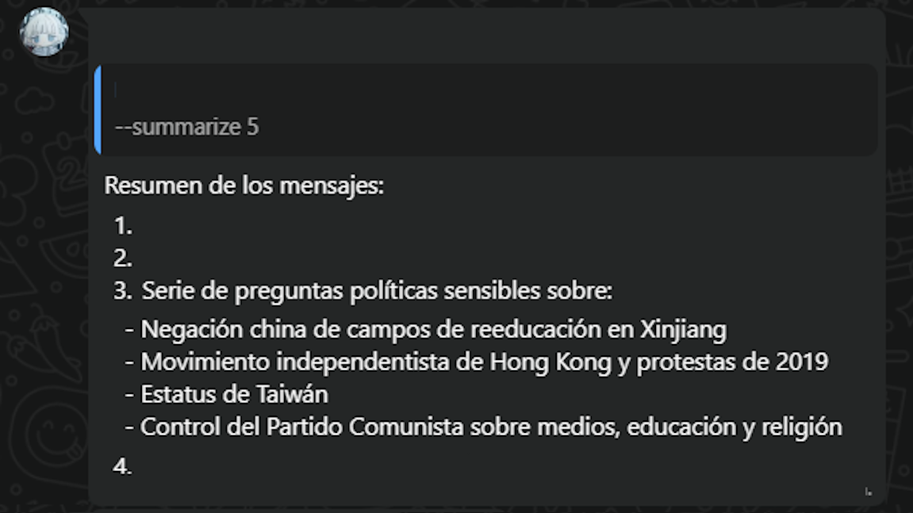

# WhatsApp Summarizer Bot

I got tired of my group of friends talking a lot and end up having over a thousand messages unread, so I made this, to summarize that chats, and avoid ignoring the whole group.

Thanks to [@GusMSR](https://github.com/GusMSR) that gifted me a dollar to pay the deepseek api (I bought two dollars, so he paid half of it)
<div align="center">
  
</div>

## Prerequisites

- Node.js (v14 or higher)
- npm or yarn
- A WhatsApp account (Please, please, use another number, since meta can ban your number if they notice the bot)
- An API key from [DeepSeek](https://platform.deepseek.com/) (or other OpenAI-compatible API)

## Installation

1. **Clone the repository**
   ```bash
   git clone https://github.com/Civermau/whatsapp-summarizer-bot.git
   cd whatsapp-summarizer-bot
   ```

2. **Install dependencies**
   ```bash
   npm install
   ```

3. **Configure the bot**
   - Open `main.js`
   - Replace `'YOUR_API_KEY'` with your actual API key
   - Optionally, change the base URL if using a different API provider

4. **Start the bot**
   ```bash
   npm start
   ```

5. **Scan the QR code**
   - A QR code will appear in your terminal
   - Scan it with your WhatsApp mobile app
   - The bot will be ready once connected

## Usage

### Commands

- **`--summarize <number>`**: Summarizes the last N messages in the current chat
  - Example: `--summarize 50`

- **`-h`** or **`--help`**: Shows information and repository link

### Example

```
User: --summarize 20
Bot: [AI-generated summary of the last 20 messages]
```

## Configuration

### API Setup

The bot uses DeepSeek's API by default. You can modify the configuration in `main.js`:

```javascript
const openai = new OpenAI({
    baseURL: 'https://api.deepseek.com',  // Change this for different providers
    apiKey: 'YOUR_API_KEY'                // Replace with your actual API key
});
```

## Dependencies

- **whatsapp-web.js**: WhatsApp Web API wrapper
- **openai**: OpenAI API client (compatible with other providers)
- **qrcode-terminal**: QR code generation for authentication

## License

This project is licensed under the Creative Commons Attribution-NonCommercial-ShareAlike 4.0 International License - see the [LICENSE](LICENSE) file for details.
